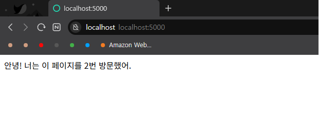

# Flask + Redis DevOps 실습 프로젝트

이 프로젝트는 Docker와 Docker Compose를 사용하여
Flask 웹 서버와 Redis 캐시 서버를 구성한 DevOps 실습입니다.

---

## 📦 구성 요소

- Flask: 웹 애플리케이션 서버
- Redis: 방문 횟수 저장 캐시
- Dockerfile: 앱 컨테이너 이미지 정의
- Docker Compose: 멀티 컨테이너 관리

---

## 🚀 실행 방법

```bash
docker-compose up --build

## 🖥 실행 화면


